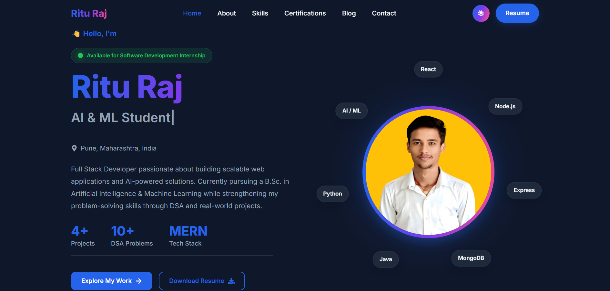

# 🚀 Ritu Raj | Full Stack Developer & AI/ML Student

<p align="center">
  
</p>

<h3 align="center">
Building scalable web applications and exploring AI-powered solutions 🤖
</h3>

<p align="center">
Full Stack Developer | MERN Stack | AI/ML Student | DSA Enthusiast
</p>


<p align="center">

<a href="https://riturajlabs.vercel.app/">

</a>

<a href="https://github.com/riturajlabs">

</a>

<a href="https://linkedin.com/in/riturajlabs">

</a>

</p>


---

# 👨‍💻 About Me


Hi, I'm **Ritu Raj** 👋

I am a **Full Stack Developer** and **B.Sc Artificial Intelligence & Machine Learning student** passionate about building real-world applications and exploring AI-powered solutions.

I love creating modern web applications, solving problems using **Data Structures & Algorithms**, and experimenting with **Generative AI, Machine Learning, and Backend Systems**.


---

# 🛠️ Tech Stack


### Frontend

<p>


</p>


### Backend & Database

<p>


</p>


### Tools

<p>


</p>


---

# ✨ Features


| Feature | Description |
|---|---|
| ⚡ React + Vite | Modern frontend architecture |
| 🎨 Responsive UI | Works across devices |
| 🌙 Theme Support | Dark / Light mode |
| 🎭 Animations | Framer Motion powered UI |
| 📂 Projects | Dynamic showcase system |
| 📧 Contact | EmailJS integration |
| 🔍 SEO | Optimized portfolio |


---

# 📂 Project Structure


```bash
portfolio
│
├── public
│   ├── images
│   ├── resume.pdf
│   ├── robots.txt
│   └── sitemap.xml
│
├── src
│   ├── components
│   │   ├── common
│   │   ├── layout
│   │   └── sections
│   │
│   ├── context
│   ├── data
│   ├── hooks
│   ├── pages
│   ├── services
│   ├── styles
│   │
│   ├── App.jsx
│   └── main.jsx
│
├── package.json
└── vite.config.js
```


---

# 🚀 Installation


### Clone Repository

```bash
git clone https://github.com/riturajlabs/portfolio.git
```


### Install Dependencies

```bash
npm install
```


### Run Project

```bash
npm run dev
```


### Build

```bash
npm run build
```


---

# 🚀 Featured Projects


## 🤖 Orbit AI

AI-powered application exploring Generative AI concepts and intelligent systems.


**Tech Stack**


---

## 🏠 Stayora

Full-stack accommodation platform with listing management.


**Tech Stack**


---

## 🧮 Scientific Calculator

Advanced calculator supporting mathematical operations.


**Tech Stack**


---

# 📚 Currently Learning


- 🧠 Machine Learning
- 🤖 Generative AI
- 🔎 RAG Systems
- 🕵️ AI Agents
- 🏗️ System Design
- 📊 Data Structures & Algorithms


---

# 🏆 Certifications


🏅 Delta Full Stack Web Development  
🏅 Python for Data Science and Machine Learning  
🏅 Artificial Intelligence Foundations: Machine Learning  


---

# 📊 GitHub Analytics


<p align="center">


</p>


---

# 🤝 Connect With Me


<p>

<a href="https://github.com/riturajlabs">

</a>


<a href="https://linkedin.com/in/riturajlabs">

</a>


<a href="mailto:riturajlabs@outlook.com">

</a>

</p>


---

<p align="center">

⭐ If you like my work, consider starring this repository.

</p>
